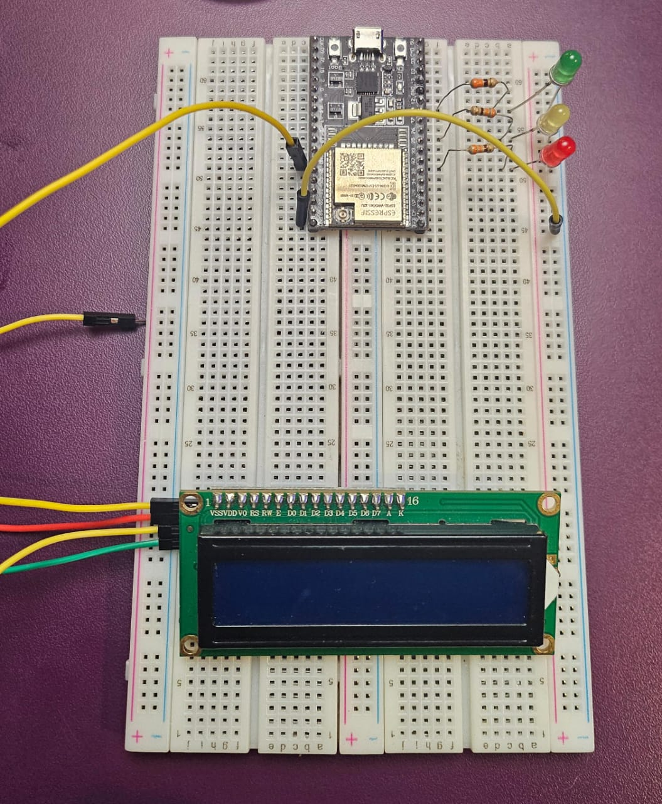
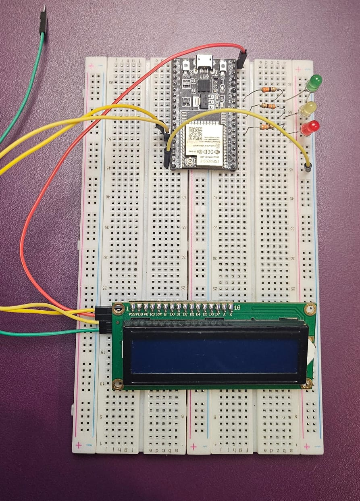

# Atividade Ponderada - Semáforo
### Estudante: Giovanna Fátima de Britto Vieira

## Sumário
[1. Instruções da Ponderada](#1-instruções-da-ponderada)

[2. Introdução](#1-introdução)

[3. Desenvolvimento](#3-desenvolvimento)

[3.1.Desenvolvimento da Montagem Física](#31-desenvolvimento-da-montagem-física)

[3.2. Detalhamento do Código](#32-detalhamento-do-código)

[4. Resultados Obtidos](#4-resultados-obtidos)

[5. Avaliação de Pares](#5-avaliação-de-pares)

[6. Conclusão](#conclusão)

## <a name="c1"></a>1. Instruções da Ponderada
Você começou a estagiar no Departamento de Engenharia de Trânsito e ficou responsável por controlar o fluxo em uma via movimentada do bairro Butantã. Seu desafio é montar e programar um semáforo que garanta a segurança de pedestres e veículos, seguindo a lógica de tempo de cada fase das luzes, desde a montagem dos LEDs até a programação da sequência correta. Agora, você tem a chance de aplicar seus conhecimentos e desenvolver um sistema essencial para o controle do trânsito. Será que você consegue criar um semáforo que funcione perfeitamente, como aqueles que encontramos nas ruas todos os dias?

**Instruções**

**Parte 1: Montagem Física do Semáforo**
Você deve realizar a montagem física de um semáforo utilizando LEDs e resistores em uma protoboard. Os LEDs devem representar as cores vermelho, amarelo e verde, seguindo o esquema de um semáforo convencional.

Para completar esta etapa:
- Conecte corretamente os LEDs e resistores na protoboard conforme o esquema.
- Certifique-se de usar os resistores adequadamente para proteger os LEDs.
- Organize a disposição dos fios para garantir clareza e facilidade de visualização.

**Parte 2: Programação e Lógica do Semáforo**
Você deve programar o comportamento do semáforo para alternar entre as fases vermelho, amarelo e verde, seguindo a lógica abaixo:
- 6 segundos no vermelho
- 2 segundos no amarelo
- 2 segundos no verde
- +2 segundos no verde (simulando um tempo adicional para pedestres terminarem a travessia)
- 2 segundos no amarelo

Esse ciclo deve ser repetido continuamente em um loop.

Para completar essa etapa:
- Escreva o código para controlar as luzes do semáforo com a temporização exata descrita.
- Teste o código e certifique-se de que as fases estão funcionando corretamente, com as transições e tempos esperados.

**Parte 3: Avaliação de Pares**

Nesta atividade, todos os alunos serão ser avaliadores e avaliados.
Cada atividade deverá ser avaliada por pelo menos dois alunos segundo os critérios do barema.

⚠️ Entrega: Poste em seu repositório pessoal do GitHub uma foto da sua montagem física (protoboard com LEDs conectados) e um breve relato explicando como foi feita a montagem e as conexões, adicione uma tabela com as especificações dos componentes utilizados. Adicione também em seu repositório do GitHub o código da programação do semáforo e um vídeo demonstrando o funcionamento do semáforo (LEDs acendendo e apagando conforme o código). Certifique-se de que o tempo de cada fase está correto. Adicionalmente, você também deve postar os resultados dos testes com os nomes completos dos avaliadores.

## <a name="c2"></a>1. Introdução
Esta atividade de programação tem como objetivo demonstrar o uso de componentes eletrônicos e simular um semáforo utilizando LEDs em uma plataforma de prototipagem como o Arduino. Sendo que, o foco principal é desenvolver e programar uma sequência de temporização para controle de fluxo em uma via simulada, onde os LEDs representam as luzes do semáforo (vermelho, amarelo e verde). A atividade se divide em três etapas:

1. **Parte 1:** Montagem física do circuito do semáforo em uma protoboard. Nessa etapa, foram utilizados LEDs e resistores para representar as cores do semáforo, montados de forma a simular o funcionamento real de um semáforo de trânsito.

2. **Parte 2:** Programação do semáforo na plataforma Arduino, com o código responsável por alternar entre as fases do semáforo: 6 segundos para o vermelho, 2 segundos para o amarelo, e 2 + 2 segundos para o verde (com tempo adicional para a travessia de pedestres). O ciclo é repetido em loop, simulando o fluxo contínuo de uma via movimentada.

3. **Parte 3:** Teste e avaliação do projeto, incluindo a verificação dos tempos de cada fase.

Por meio desta atividade, foi possível aplicar conhecimentos sobre controle de dispositivos eletrônicos, lógica de programação e prática em prototipagem física. A experiência também incluiu a prática de simulação de temporização e montagem de circuitos, aprimorando a compreensão do funcionamento de um semáforo convencional no contexto de um projeto realista.

## <a name="c3"></a>3. Desenvolvimento
### <a name="c4"></a>3.1. Desenvolvimento da Montagem Física

**Passo 1: Separação dos Materiais**

A primeira parte da execução da atividade consistiu na separação dos materiais.

<div align="center">
  <p> <b>Figura 1 </b> - Separação dos Materiais</p>

 <p><b>Fonte:</b> Material elaborado pelo autor (2024)</p>
</div>

Sendo assim, conforme evidenciado na imagem, os materiais utilizados para essa atividade foram:
- Protoboard;
- ESP-32;
- LED Vermelho;
- LED Verde;
- LED Amarelo;
- 3 Resitores;
- 1 Display LCD 16X2;
- 1 Jumper macho-macho;
- 4 Jumpers macho-fêmea;

Aqui está uma tabela de especificação dos componentes utilizados na montagem do semáforo:

| Componente             | Função                                            | Especificação                  | Quantidade |
|------------------------|---------------------------------------------------|--------------------------------|------------|
| Protoboard             | Base para montagem do circuito                    | -                              | 1          |
| ESP-32                 | Microcontrolador para controle dos LEDs e LCD     | Modelo ESP32                   | 1          |
| LED Vermelho           | Indicação de parada no semáforo                   | 5mm                            | 1          |
| LED Amarelo            | Indicação de atenção no semáforo                  | 5mm                            | 1          |
| LED Verde              | Indicação de passagem no semáforo                 | 5mm                            | 1          |
| Resistor               | Proteção para os LEDs                             | 220Ω                           | 3          |
| Display LCD 16x2       | Exibição de mensagens de status do semáforo       | I2C 16 colunas, 2 linhas       | 1          |
| Jumper macho-macho     | Conexão entre o ESP-32 e componentes na protoboard | -                              | 1          |
| Jumper macho-fêmea     | Conexão entre o ESP-32 e o display LCD            | -                              | 4          |


**Passo 2: Os Leds são conectados na Protoboard**

O segundo passo de execução consiste em colocar os leds na protoboard. Dessa forma, o lado negativo dos leds foram colocados diretamento no negativo da protoboard, visando a economia dos fios e tornando mais agradável visualmente. Além disso, os polos positivos do Led também foram conectados na linha de cada porta do ESP-32 (conforme consta na imagem abaixo).


<div align="center">
  <p> <b>Figura 2 </b> - Coloca os Leds na Protoboard</p>

 <p><b>Fonte:</b> Material elaborado pelo autor (2024)</p>
</div>

**Passo 3: Conecta os resistores no LED**

Após conetar os Leds na protoboard, o terceiro passo consiste em conectar os resistores no polo positivo do Led e na porta do ESP-32, chegando a seguinte configuração:

- Led Verde conectado no pino 12;
- Led Amarelo conectado no pino 26;
- Led Vermelho conectado no pino 32;

<div align="center">
  <p> <b>Figura 3 </b> - Conecta os Resitores </p>

 <p><b>Fonte:</b> Material elaborado pelo autor (2024)</p>
</div>

**Passo 4: Conecta o GND no ESP-32**

O quarto passo consistiu em conectar o lado negativo da protoboard na porta GND do ESP-32, chegando ao circuito representado na imagem abaixo.

<div align="center">
  <p> <b>Figura 4 </b> - Conecta o GND</p>

 <p><b>Fonte:</b> Material elaborado pelo autor (2024)</p>
</div>

**Passo 5: Conexão dos Jumpers no Display LCD**

No quinto passo, foi feita a conexão entre os jumpers com os pinos do display lcd, conforme consta abaixo.

<div align="center">
  <p> <b>Figura 5 </b> - Conecta os cabos no Display LCD</p>

 <p><b>Fonte:</b> Material elaborado pelo autor (2024)</p>
</div>

**Passo 6: Conexão do pino GND no ESP-32**

No sexto passo, o pino GND do módulo I2C foi conectado ao pino GND do ESP32 (imagem abaixo).

<div align="center">
  <p> <b>Figura 6 </b> - Conecta o GND do Display</p>

 <p><b>Fonte:</b> Material elaborado pelo autor (2024)</p>
</div>


**Passo 7: Conexão do VCC no ESP-32**

No sexto passo, o pino  VCC do módulo I2C foi conectado no pino 5V do ESP32;

<div align="center">
  <p> <b>Figura 7 </b> - Conecta o VCC do Display</p>

 <p><b>Fonte:</b> Material elaborado pelo autor (2024)</p>
</div>

**Passo 7: Conexão do SDA no ESP-32**

No sexto passo, o pino SDA do módulo I2C dfoi conectado ao pino D21 (GPIO 21) do ESP32;

<div align="center">
  <p> <b>Figura 8 </b> - Conecta o pino SDA do Display</p>

 <p><b>Fonte:</b> Material elaborado pelo autor (2024)</p>
</div>

**Passo 7: Conexão do SCL no ESP-32**

No sexto passo, o pino SCL do módulo I2C foi conectado ao pino D22 (GPIO 22) da ESP32.

<div align="center">
  <p> <b>Figura 9 </b> - Conecta o pino SCL do Display</p>

 <p><b>Fonte:</b> Material elaborado pelo autor (2024)</p>
</div>

**Passo 10: Conecta o circuito ao computador**

No décimo passo, todo o circuito montado com ESP32 na protoboard foi conectado ao computador para download do código.

<div align="center">
  <p> <b>Figura 10 </b> - Conecta o ESP32 no Computador</p>

 <p><b>Fonte:</b> Material elaborado pelo autor (2024)</p>
</div>

E assim que o cabo foi conectado todos os componentes ligaram, conforme consta na imagem abaixo.

<div align="center">
  <p> <b>Figura 11 </b> - Componentes Ligados</p>

 <p><b>Fonte:</b> Material elaborado pelo autor (2024)</p>
</div>

**Passo 11: Criação do Código**

No décimo primeiro passo foi feita a criação do código (figura abaixo), de forma atender o que foi pedido na atividade. Para entender como o código foi feito, consulte a [seção 3.2](#32-detalhamento-do-código).

<div align="center">
  <p> <b>Figura 12 </b> - Captura de uma parte do código</p>

 <p><b>Fonte:</b> Material elaborado pelo autor (2024)</p>
</div>

**Passo 12: Download do Código no ESP32**

Após a realização da montagem do circuito e a criação do código, foi feito o download dele no microcontrolador, de forma que foi possível visualizar os [resultado obtidos](#4-resultados-obtidos).


### 3.2. Detalhamento do Código

Conforme demonstrado no décimo primeiro passo, foi feito um código que atendesse as demandas do projeto, no qual seguisse a seguinte lógica:
- 6 segundos no vermelho
- 2 segundos no amarelo
- 2 segundos no verde
- +2 segundos no verde (simulando um tempo adicional para pedestres terminarem a travessia)
- 2 segundos no amarelo

Dessa forma, utilizando a linguagem C++ foi produzido o seguinte [código](./src/codigo_semaforo/). Esse código apresenta a seguinte estrutrura:

<div align="center">
  <p> <b>Figura 13 </b> - Primeira parte do Código</p>

 <p><b>Fonte:</b> Material elaborado pelo autor (2024)</p>
</div>

<div align="center">
  <p> <b>Figura 14 </b> - Segunda parte do Código</p>

 <p><b>Fonte:</b> Material elaborado pelo autor (2024)</p>
</div>

<div align="center">
  <p> <b>Figura 15 </b> - Terceira parte do Código</p>

 <p><b>Fonte:</b> Material elaborado pelo autor (2024)</p>
</div>


Quanto a explicação do que foi feito, temos:

1. **Inclusão de Bibliotecas**:
   - As bibliotecas `Wire.h` e `LiquidCrystal_I2C.h` foram incluídas no início para permitir a comunicação I2C com o display LCD. 

2. **Configuração do Display LCD**:
   - A linha `LiquidCrystal_I2C lcd(0x27, 16, 2);` definiu o endereço I2C do display e suas dimensões (16 colunas e 2 linhas), permitindo que o Arduino se comunique com o LCD para exibir mensagens.

3. **Definição dos Pinos dos LEDs**:
   - Os pinos dos LEDs do semáforo foram definidos com `#define`, associando `ledVerde` ao pino 12, `ledAmarelo` ao pino 26 e `ledVermelho` ao pino 32, representando as cores do semáforo.

4. **Função `setup()`**:
   - Na função `setup()` foram configurados os pinos dos LEDs como saídas usando `pinMode()`, além da inicialização do display LCD e ativação da sua luz de fundo.
   
   ```cpp
   pinMode(ledVerde, OUTPUT);
   pinMode(ledAmarelo, OUTPUT);
   pinMode(ledVermelho, OUTPUT);
   lcd.init();
   lcd.backlight();
   ```

5. **Função `acenderLed(int led, int time, bool travessia)`**:
   - Essa função controla o comportamento de cada LED com base no tempo especificado. A função acende o LED por um tempo (`time`) em milissegundos e decide se o LED deve piscar (no caso de travessia de pedestre) ou apenas desligar após o tempo.
   
   ```cpp
   digitalWrite(led, HIGH);
   delay(time);
   lcd.clear();
   ```

   - Caso `travessia` seja `false`, o LED é apagado imediatamente após o tempo especificado.
   
   ```cpp
   digitalWrite(led, LOW);
   ```

   - Se `travessia` for `true`, o LED pisca cinco vezes para simular o aviso de travessia de pedestre.
   
   ```cpp
   for (int i = 0; i < 5; i++) {
      digitalWrite(led, HIGH);
      delay(200);
      digitalWrite(led, LOW);
      delay(200);
   }
   ```

6. **Função `exibirMensagem(String sms1, String sms2)`**:
   - A função `exibirMensagem` exibe duas linhas de texto no display LCD. A primeira linha mostra `sms1`, enquanto `sms2` aparece na segunda linha, após o cursor ser reposicionado.
   
   ```cpp
   lcd.print(sms1);
   lcd.setCursor(0, 1);
   lcd.print(sms2);
   ```

7. **Função `loop()`**:
   - A função `loop()` executa o ciclo do semáforo repetidamente, exibindo mensagens no LCD e acionando os LEDs em sequência com os tempos e comportamentos especificados:
      - **Vermelho**: Exibe a mensagem “Atenção, Carro Passando!” e acende o LED vermelho por 6 segundos.
      - **Amarelo**: Exibe “Atenção, ainda não passe!” e acende o LED amarelo por 2 segundos.
      - **Verde**: Exibe “Agora, pode passar!” e acende o LED verde por 2 segundos, seguido de um pisca-pisca para simular travessia de pedestres.
      - **Amarelo (novamente)**: Exibe “Atenção, ainda não passe!” e acende o LED amarelo por mais 2 segundos.

   ```cpp
   exibirMensagem("Atencao, Carro", "Passando!");
   acenderLed(ledVermelho, 6000, false);

   exibirMensagem("Atencao, ainda", "nao passe!");
   acenderLed(ledAmarelo, 2000, false);

   exibirMensagem("Agora, pode", "passar!");
   acenderLed(ledVerde, 2000, true);

   exibirMensagem("Atencao, ainda", "nao passe!");
   acenderLed(ledAmarelo, 2000, false);
   ```

## 4. Resultados Obtidos

Após a realização de todas as etapas anteriores, foi possível verificar o funcionamento do circuito por meio do seguinte [vídeo](./assets/projetoFinal.mp4).
Por meio dele é possível concluir que os resultados foram satisfatórios em termos de funcionalidade e replicação do comportamento esperado de um semáforo. O sistema seguiu os tempos de cada fase (vermelho, amarelo e verde), garantindo a simulação  do fluxo de trânsito e a segurança dos pedestres.

1. **Funcionamento do Semáforo:**
   - O semáforo operou com sucesso em um ciclo contínuo, alternando entre as luzes de acordo com o tempo programado:
     - **Vermelho:** permaneceu aceso por 6 segundos, indicando que veículos deviam parar.
     - **Amarelo:** acendeu por 2 segundos antes de mudar para verde e, após o ciclo do verde, acendeu novamente por 2 segundos para preparar os veículos para parar.
     - **Verde:** acendeu por 2 segundos para permitir a passagem dos veículos e, após esse período, piscou cinco vezes para indicar a travessia de pedestres, seguindo o comportamento esperado.

2. **Interação com o Display LCD:**
   - As mensagens no display LCD mudaram de acordo com cada fase do semáforo, informando de forma clara os estados “Atenção, Carro Passando!”, “Atenção, ainda não passe!” e “Agora, pode passar!”. A combinação das mensagens visuais com a temporização dos LEDs auxiliou na comunicação eficaz do estado do semáforo.

3. **Pisca-Pisca no Verde para Pedestres:**
   - O LED verde piscou cinco vezes após os 2 segundos iniciais de luz contínua, indicando tempo extra para travessia de pedestres. Esse efeito foi usado para reforçar a segurança do sistema e tornando o comportamento do semáforo mais realista.

4. **Estabilidade do Ciclo:**
   - O ciclo de operação do semáforo foi estável, sem falhas ou atrasos. A programação garantiu que os tempos fossem respeitados e que as transições entre as luzes ocorressem suavemente. 

Entretanto, essa ainda continua sendo os resultados obtidos na visão do autor do projeto, logo visando verificar se de fato o projeto atendeu às necessidades do problema, foi feita uma avaliação entre os pares, conforme consta na [seção seguinte](#5-avaliação-de-pares).

## 5. Avaliação de Pares

A avaliação de pares foi feita com o objetivo de outros estudantes validarem o projeto feito para essa atividade, sendo assim, essa ponderada foi avaliada pelo [Marco Ruas Sales Peixoto](https://www.linkedin.com/in/marcoruas/) e [Isadora Tribst Gatto](https://www.linkedin.com/in/isadoragatto/), conforme consta nas tabelas abaixo.

#### Avaliador: Marco Ruas Sales Peixoto

| Critério                                                                                                 | Contempla (Pontos) | Contempla Parcialmente (Pontos) | Não Contempla (Pontos) | Observações do Avaliador |
|---------------------------------------------------------------------------------------------------------|--------------------|----------------------------------|--------------------------|---------------------------|
| Montagem física com cores corretas, boa disposição dos fios e uso adequado de resistores                | 3             |             -                        |                 -          | Utilizou poucos fios e bem organizados, ficou fofo!! 
| Temporização adequada conforme tempos medidos com auxílio de algum instrumento externo | 3 | - | -                         | Tempo extretamente preciso e sem erros, nice!!                          | 
| Código implementa corretamente as fases do semáforo e estrutura do código (variáveis representativas e comentários) | 3 | - | - |    Pior que me deixou extremamente surpreso, não imagina a lógica estar tão boa assim, está de parabéns!!!!!                       |
| Extra: Implementou um componente de liga/desliga no semáforo e/ou usou ponteiros no código | 1 |  - | - | Utilizou um LSD como componente e estrutura OPP, realmente surpreendente!!! |
|  |                                                             |  | |**Pontuação Total**: 10 |

#### Avaliador: Isadora Tribst Gatto

| Critério                                                                                                 | Contempla (Pontos) | Contempla Parcialmente (Pontos) | Não Contempla (Pontos) | Observações do Avaliador |
|---------------------------------------------------------------------------------------------------------|--------------------|----------------------------------|--------------------------|---------------------------|
| Montagem física com cores corretas, boa disposição dos fios e uso adequado de resistores                | 3 |  | |  As montagens das cores estão corretas, os fios estão organizados e não estão bagunçados e os resistores estão funcionando, nenhuma luz queimou     |
| Temporização adequada conforme tempos medidos com auxílio de algum instrument   | 3 |   |       | Os leds estão piscando no tempo ideal, conforme foi pedido nas instruções
| Código implementa corretamente as fases do semáforo e estrutura do código (variáveis representativas e comentários) | 3 |      |   | O código foi muito bem estruturado mas poderia apresentar comentários para facilitar a interpretação  |
| Extra: Implmeentou um componente de liga/desliga no semáforo e/ou usou ponteiros no código | 1 | |  |Você foi muito além implementando o display LCD, com um alerta para cada cor de led |
|  |                                                             |  | |**Pontuação Total: 10**|

## Conclusão

Por meio da realização dessa atividade foi possível aprender sobre o uso do ESP32 na criação e controle de um sistema de semáforo. A primeira etapa da atividade possibilitou entender a montagem de um circuito com LEDs e resistores, abordando os conceitos de eletrônica necessários para a construção de um semáforo funcional.

Enquanto isso, a etapa de programação também foi importante, porque abordou a lógica de controle de tempo e transição entre as luzes, simulando o ciclo de um semáforo real. A implementação da lógica de temporização reforçou a importância de um código bem estruturado para garantir a precisão e a segurança do sistema, especialmente ao incluir o pisca-pisca para travessia de pedestres.

Além disso, o uso do display LCD melhorou a experiência do usuário ao exibir mensagens correspondentes a cada fase do semáforo, o que acrescentou mais segurança ao projeto e contribuiu para o desenvolvimento de habilidades em comunicação visual em eletrônica.

Em resumo, essa atividade não só permitiu executar a tarefa proposta, mas também consolidou conhecimentos sobre controle eletrônico e programação com microcontrolador.